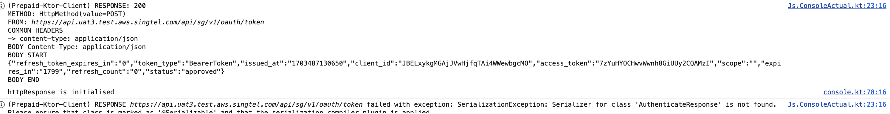

# Multiplatform Ktor Repository Module

**Kotlin Multiplatform** project with SwiftUI, Jetpack Compose, Compose for Wear OS, Compose for Desktop, Compose for Web, and Kotlin/JS + React clients along with Ktor backend. Currently running on
* Android (Jetpack Compose)
* iOS (Compose for iOS - experimental support!)
* Web (Kotlin/JS + React Wrapper)

This Project provides Repository Layers that uses Ktor under the hood to provide networking and can
be used in Web, iOS and Android platforms

### Building

### Kotlin JS + React for Web client (JS)
To exercise (React based) web client run `./gradlew :web:browserDevelopmentRun`.

For packaging run below command './gradlew :web:packJsPackages'
output will be in shared/build/packages/shared-unspecified.tgz file (not yet figured how to name
file correctly the "unspecified").

### Compose for iOS client

TODO

### Screenshots
Web demo

TODO

**Android (Jetpack Compose)**
TODO

**Web App (Kotlin/JS + React)**
TODO

### Languages, libraries and tools used

* [Kotlin](https://kotlinlang.org/)
* [Kotlin Coroutines](https://kotlinlang.org/docs/reference/coroutines-overview.html)
* [Kotlinx Serialization](https://github.com/Kotlin/kotlinx.serialization)
* [Ktor client library](https://github.com/ktorio/ktor)
* [Android Architecture Components](https://developer.android.com/topic/libraries/architecture/index.html)
* [Koin](https://github.com/InsertKoinIO/koin)
* [Jetpack Compose](https://developer.android.com/jetpack/compose)
* [KMP-NativeCoroutines](https://github.com/rickclephas/KMP-NativeCoroutines)
* [Coil](https://coil-kt.github.io/coil/)
